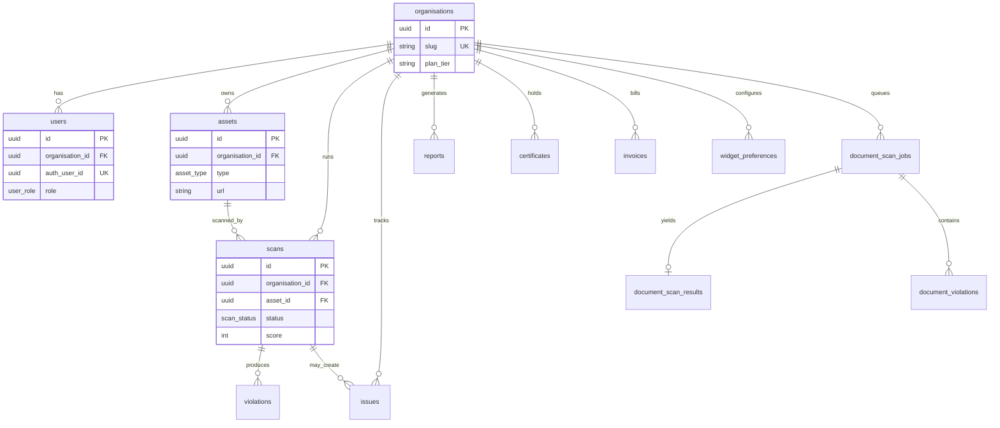
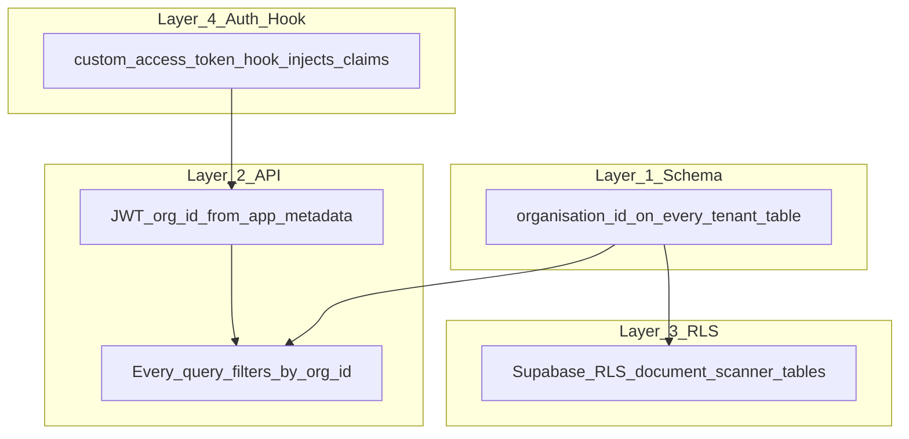

# 03 — Data and Multi-Tenancy

[← Monorepo](./02-monorepo-and-packages.md) | [Index](./README.md) | [Next: Auth & Security →](./04-auth-and-security.md)

## Executive Summary

All tenant data lives in **PostgreSQL 16**, accessed via **Drizzle ORM**. Every tenant-scoped table includes `organisation_id`. The API enforces isolation using JWT `org_id`; document scanner tables additionally use Supabase **Row Level Security (RLS)**.

---

## Entity Relationship (logical)



**Interpretation:** `organisations` is the tenant root. `users` link Supabase Auth IDs to orgs and roles. `assets` are scan targets; `scans` and `violations` hold web/mobile results. Document scanning uses a parallel `document_scan_*` model.

---

## Core Tables

Source: [`packages/db/src/schema.ts`](../../packages/db/src/schema.ts)

| Table                   | Tenant-scoped | Purpose                             |
| ----------------------- | ------------- | ----------------------------------- |
| `organisations`         | Root          | Tenant identity, plan tier, GSTIN   |
| `users`                 | Yes           | Maps `auth_user_id` → org + role    |
| `assets`                | Yes           | Websites, apps, documents to audit  |
| `scans`                 | Yes           | Web/mobile scan jobs and scores     |
| `violations`            | Yes           | Per-scan rule failures              |
| `issues`                | Yes           | Remediation workflow                |
| `reports`               | Yes           | Generated compliance reports        |
| `certificates`          | Yes           | Accessibility certification records |
| `invoices`              | Yes           | Billing (amounts in paise)          |
| `widget_preferences`    | Yes           | Widget config per org/asset         |
| `audit_logs`            | Yes           | Audit trail                         |
| `waitlist_signups`      | No            | Marketing waitlist                  |
| `document_scan_jobs`    | Yes           | Document scan queue state           |
| `document_scan_results` | Yes           | Aggregated doc scan output          |
| `document_violations`   | Yes           | Normalized doc violations           |

---

## Key Enums

| Enum                 | Values                                                                 |
| -------------------- | ---------------------------------------------------------------------- |
| `user_role`          | super_admin, customer_admin, accessibility_officer, developer, auditor |
| `asset_type`         | website, web_app, mobile_app, document, pdf                            |
| `scan_status`        | pending, running, completed, failed                                    |
| `issue_status`       | open, in_progress, resolved, wont_fix, duplicate                       |
| `issue_severity`     | critical, serious, moderate, minor                                     |
| `invoice_status`     | draft, sent, paid, overdue, cancelled                                  |
| `certificate_status` | active, expired, revoked                                               |

---

## Multi-Tenancy Layers



### Layer 1 — Schema

Reusable helper in schema:

```typescript
const orgId = () =>
  uuid('organisation_id')
    .notNull()
    .references(() => organisations.id, { onDelete: 'cascade' });
```

### Layer 2 — API middleware

[`apps/api/src/middleware/auth.ts`](../../apps/api/src/middleware/auth.ts) verifies Supabase JWT and sets `req.user.org_id`. All protected routes must filter by this value — never trust `organisation_id` from the request body.

Claims resolution: [`apps/api/src/lib/resolve-claims.ts`](../../apps/api/src/lib/resolve-claims.ts)  
DB fallback (dev): [`packages/db/src/user-claims.ts`](../../packages/db/src/user-claims.ts)

### Layer 3 — Row Level Security

Document scanner RLS policies: [`supabase/migrations/004_document_scanner.sql`](../../supabase/migrations/004_document_scanner.sql)

Core tenant tables rely on API-layer filtering today; RLS extension to all tables is a future hardening step.

### Layer 4 — JWT claim injection

On login, Supabase custom access token hook reads `public.users` and injects `app_metadata.user_role` and `app_metadata.org_id`:

[`packages/db/seed/supabase-auth-hook.sql`](../../packages/db/seed/supabase-auth-hook.sql)

---

## Plan Tier Feature Gating

| Tier             | Typical limits (from `.cursorrules`)                      |
| ---------------- | --------------------------------------------------------- |
| **starter**      | 1 asset, 3 scans/month, no AI remediation, no SEBI report |
| **professional** | 10 assets, unlimited scans, AI remediation                |
| **enterprise**   | Unlimited assets/scans, AI, SEBI report                   |
| **government**   | Same as enterprise                                        |

Enforced in API middleware and route handlers (e.g. document scan limits in [`apps/api/src/routes/document-scans.ts`](../../apps/api/src/routes/document-scans.ts)).

---

## Data Stores Beyond PostgreSQL

| Store                      | Role                         | Key patterns                                                                 |
| -------------------------- | ---------------------------- | ---------------------------------------------------------------------------- |
| **Redis**                  | Cache, rate limits, progress | `scan:progress:{id}`, `mobile-scan:progress:{id}`, `document-scan-jobs` list |
| **S3** (or local fallback) | Artifacts                    | Screenshots, reports, mobile APKs, document uploads                          |
| **RabbitMQ**               | Job queues                   | `scans`, `mobile-scan-jobs`, `scan_cancellations`                            |

### S3 key conventions (examples)

- Documents: `document-scans/{orgId}/{jobId}/{filename}` — [`apps/api/src/services/document-storage.ts`](../../apps/api/src/services/document-storage.ts)
- Mobile apps: uploaded via [`apps/api/src/services/s3-upload.ts`](../../apps/api/src/services/s3-upload.ts)

**Dev fallback:** When `S3_BUCKET_NAME` is unset or `*_STORAGE_LOCAL=true`, API writes to local filesystem.

---

## Migrations

| Path                      | Tool                      | Notes                         |
| ------------------------- | ------------------------- | ----------------------------- |
| `packages/db/migrations/` | Drizzle Kit               | Primary schema evolution      |
| `supabase/migrations/`    | Supabase CLI / SQL Editor | RLS, seeds, auth-adjacent DDL |

**Tech debt:** Maintain parity between Drizzle and Supabase migration paths before production.

### Seed data

- Dev seed: [`packages/db/seed/dev.sql`](../../packages/db/seed/dev.sql) via `pnpm db:seed`
- Document scanner seed: [`supabase/migrations/004_document_scanner_seed.sql`](../../supabase/migrations/004_document_scanner_seed.sql)

---

## Source References

- Schema: [`packages/db/src/schema.ts`](../../packages/db/src/schema.ts)
- DB factory: [`packages/db/src/index.ts`](../../packages/db/src/index.ts)
- Local Postgres: [`docker-compose.yml`](../../docker-compose.yml) (port **5433**)
