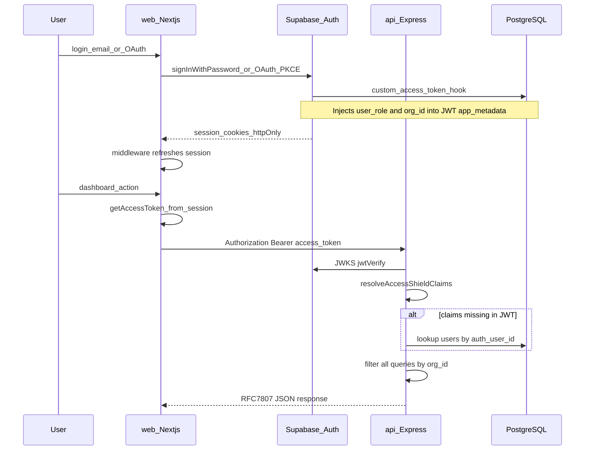
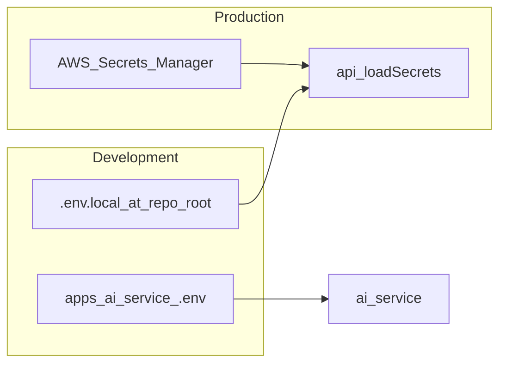

# 04 — Auth and Security

[← Data & Multi-Tenancy](./03-data-and-multi-tenancy.md) | [Index](./README.md) | [Next: Scan Pipelines →](./05-scan-pipelines.md)

## Executive Summary

End-user authentication is delegated to **Supabase Auth** (PKCE flow, httpOnly cookies). The API validates **Bearer JWTs** via Supabase JWKS and enforces **RBAC** plus **organisation isolation**. Internal AI calls use a shared secret header. Production secrets load from **AWS Secrets Manager**.

---

## Authentication Flow

**Interpretation:** Users never send org_id manually. The JWT (or DB fallback) supplies tenant context. API rejects requests without valid `user_role` and `org_id`.

---

## Key Components

| Layer               | File                                                                                       | Responsibility                                     |
| ------------------- | ------------------------------------------------------------------------------------------ | -------------------------------------------------- |
| Browser client      | [`apps/web/src/lib/supabase/client.ts`](../../apps/web/src/lib/supabase/client.ts)         | PKCE Supabase client                               |
| Server client       | [`apps/web/src/lib/supabase/server.ts`](../../apps/web/src/lib/supabase/server.ts)         | RSC / route handlers                               |
| Route protection    | [`apps/web/middleware.ts`](../../apps/web/middleware.ts)                                   | Redirect unauthenticated users from `/dashboard/*` |
| Token for API       | [`apps/web/src/lib/api/client.ts`](../../apps/web/src/lib/api/client.ts)                   | `getAccessToken()` → Bearer header                 |
| Server auth context | [`apps/web/src/lib/auth/server.ts`](../../apps/web/src/lib/auth/server.ts)                 | Claims for Server Components                       |
| JWT verification    | [`apps/api/src/middleware/auth.ts`](../../apps/api/src/middleware/auth.ts)                 | jose + remote JWKS                                 |
| Claims resolution   | [`apps/api/src/lib/resolve-claims.ts`](../../apps/api/src/lib/resolve-claims.ts)           | `app_metadata` or DB fallback                      |
| Auth hook SQL       | [`packages/db/seed/supabase-auth-hook.sql`](../../packages/db/seed/supabase-auth-hook.sql) | Inject claims at token issue                       |

### JWT claims shape

From [`packages/types`](../../packages/types/src/index.ts) — `AccessShieldJwtClaims`:

- `sub` — Supabase user ID
- `user_role` — RBAC role
- `org_id` — Organisation UUID
- `email`, `iat`, `exp`

### Token lifetime

Supabase `jwt_expiry = 3600` (1 hour) in [`supabase/config.toml`](../../supabase/config.toml). Refresh handled by Supabase client + middleware.

---

## Role-Based Access Control (RBAC)

Roles (enum in schema): `super_admin`, `customer_admin`, `accessibility_officer`, `developer`, `auditor`

Enforced via [`apps/api/src/middleware/rbac.ts`](../../apps/api/src/middleware/rbac.ts) — `requireRoles(...)` on routes.

| Role                      | Typical access                             |
| ------------------------- | ------------------------------------------ |
| **super_admin**           | Platform admin (`/api/v1/admin/*`) only    |
| **customer_admin**        | Full org management, billing, user invites |
| **accessibility_officer** | Scans, issues, reports, certs              |
| **developer**             | Assets, scans, issue fixes                 |
| **auditor**               | Read-only scans, issues, reports, certs    |

**Examples:**

- Document upload: `customer_admin`, `accessibility_officer`, `developer`
- Admin org list: `super_admin` only ([`apps/api/src/routes/admin/index.ts`](../../apps/api/src/routes/admin/index.ts))
- Issue status change: `developer`, `accessibility_officer`, `customer_admin`

Web middleware also reads claims for dashboard routing ([`apps/web/middleware.ts`](../../apps/web/middleware.ts)).

---

## Service-to-Service Authentication

### API → AI service

[`apps/api/src/lib/ai-client.ts`](../../apps/api/src/lib/ai-client.ts) sends:

| Header           | Purpose                                   |
| ---------------- | ----------------------------------------- |
| `X-Internal-Key` | Shared secret (`INTERNAL_AI_SERVICE_KEY`) |
| `X-Org-Id`       | Rate limiting per org                     |
| `X-Org-Plan`     | Plan-tier rate limits                     |

Validated in [`apps/ai-service/middleware/auth.py`](../../apps/ai-service/middleware/auth.py).

`/health` and `/metrics` on AI service are unauthenticated.

### API → Supabase Admin

[`apps/api/src/services/supabase-admin.ts`](../../apps/api/src/services/supabase-admin.ts) uses `SUPABASE_SERVICE_ROLE_KEY` for user provisioning (signup, sysadmin seed).

---

## Secrets Management

| Environment    | Mechanism                            | File                                                                     |
| -------------- | ------------------------------------ | ------------------------------------------------------------------------ |
| Local API      | `process.env` from root `.env.local` | [`apps/api/src/config/env.ts`](../../apps/api/src/config/env.ts)         |
| Production API | AWS Secrets Manager JSON blob        | [`apps/api/src/config/secrets.ts`](../../apps/api/src/config/secrets.ts) |
| Local AI       | `apps/ai-service/.env`               | [`apps/ai-service/config.py`](../../apps/ai-service/config.py)           |

**Required API secret keys:** `DATABASE_URL`, `REDIS_URL`, `RABBITMQ_URL`, `SUPABASE_JWT_SECRET`, `SUPABASE_URL`, `SUPABASE_ANON_KEY`, `SUPABASE_SERVICE_ROLE_KEY`

Secrets are redacted in logs ([`apps/api/src/lib/logger.ts`](../../apps/api/src/lib/logger.ts)).

---

## Security Controls

| Control               | Implementation                                                                                                  |
| --------------------- | --------------------------------------------------------------------------------------------------------------- |
| HTTP security headers | `helmet` on API ([`apps/api/src/index.ts`](../../apps/api/src/index.ts))                                        |
| CORS                  | Restricted origin in production                                                                                 |
| Rate limiting         | Redis sliding window — API + AI service                                                                         |
| Input validation      | Zod (API), Pydantic v2 (AI)                                                                                     |
| Error responses       | RFC 7807 Problem Details — no stack traces to clients                                                           |
| DLP before AI         | [`apps/ai-service/utils/dlp.py`](../../apps/ai-service/utils/dlp.py) — redacts Aadhaar, PAN, phone, email, etc. |
| Multi-tenancy         | JWT `org_id` filter on every query                                                                              |
| Widget verify         | Public endpoint; 3s timeout fail-open ([`apps/widget`](../../apps/widget/src/widget.ts))                        |

### Widget token model

Separate from user JWT — org-specific widget token verified via `GET /api/v1/widget/verify?token=...`. Signing uses `JWT_SECRET` env in widget routes ([`apps/api/src/routes/widget.ts`](../../apps/api/src/routes/widget.ts)).

---

## Realtime (parallel auth path)

Dashboard scan live updates use **Supabase Realtime** on the `scans` table ([`apps/web/src/lib/hooks/useRealtime.ts`](../../apps/web/src/lib/hooks/useRealtime.ts)) — authenticated via Supabase session, not Express API.

---

## Security Review Checklist

- [ ] Custom access token hook enabled in Supabase Dashboard
- [ ] `SUPABASE_SERVICE_ROLE_KEY` never exposed to browser
- [ ] `INTERNAL_AI_SERVICE_KEY` rotated and matched between api + ai-service
- [ ] RLS policies applied for document scanner in hosted Supabase
- [ ] Production CORS locked to `https://accessshield.in`
- [ ] AWS Secrets Manager used in production (not plain env vars)

---

## Source References

- Login UI: [`apps/web/src/components/marketing/LoginForm.tsx`](../../apps/web/src/components/marketing/LoginForm.tsx)
- OAuth callback: [`apps/web/src/app/auth/callback/route.ts`](../../apps/web/src/app/auth/callback/route.ts)
- Sysadmin seed: [`scripts/seed-sysadmin.sh`](../../scripts/seed-sysadmin.sh)
